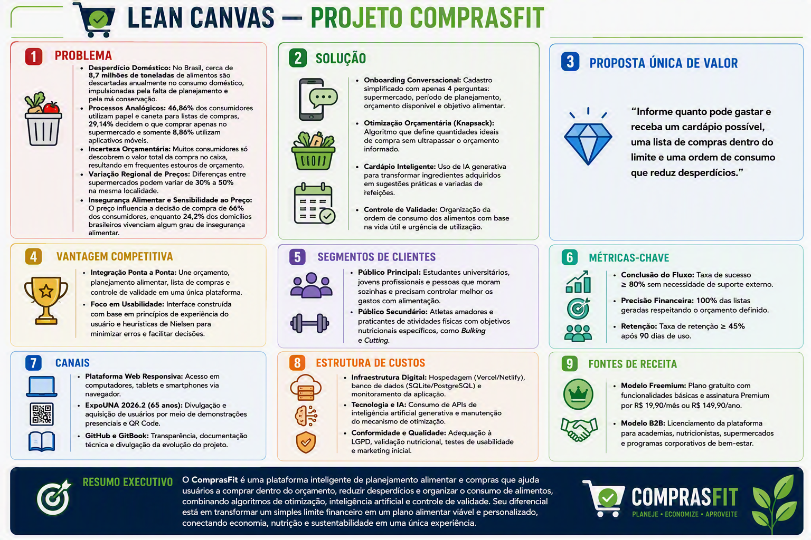

# 🔍 Descoberta do Problema!

### 1.1. Identificação e Descrição do Problema&#x20;

O planejamento alimentar e a gestão financeira doméstica caminham lado a lado, mas representam um dos maiores desafios cotidianos na vida de estudantes, jovens profissionais, atletas amadores e pessoas que moram sozinhas. A falta de ferramentas integradas e inteligentes cria um cenário de ineficiência de recursos, estresse financeiro e desperdício de alimentos.

#### 📌 Contexto e Impacto: Gargalos e Ineficiências Atuais

Atualmente, o processo de planejar o que comer e o que comprar é fragmentado, analógico e cheio de fricção:

1. **Desconexão entre Compra e Consumo:** O consumidor costuma ir ao supermercado sem saber exatamente o que cozinhar ou quais nutrientes precisa adquirir (sobra comida e falta proteína, por exemplo). O erro clássico consiste em "comprar por impulso e depois tentar inventar uma receita com o que restou".
2. **Falta de Previsibilidade Orçamentária:** A pessoa não tem clareza de quanto custará a sua cesta de compras antes de passar os produtos no leitor do supermercado, tornando o estouro de orçamento um evento frequente e indesejado.
3. **Flutuação Regional de Preços:** Os preços de itens idênticos oscilam de 30% a 50% entre redes varejistas na mesma localidade. Como os consumidores não têm tempo para pesquisar manualmente e comparar os encartes, acabam comprando às cegas.
4. **Desperdício de Alimentos e Dinheiro:** Itens perecíveis de alto custo (como carnes e vegetais) estragam na geladeira por falta de um cronograma sequencial de consumo voltado para o prazo de validade.
5. **Complexidade Nutricional:** Montar uma estratégia de alimentação específica (como _Bulking_ para ganho de massa ou _Cutting_ para perda de gordura) exige cálculos de macronutrientes complexos que a maioria das pessoas não sabe realizar de forma autônoma dentro de suas restrições orçamentárias]

#### 📊 Evidências do Problema: Dados e Pesquisas de Mercado

A relevância social, econômica e ambiental desse cenário é corroborada por dados oficiais e pesquisas recentes:O Desperdício Doméstico de Alimentos no Brasil

* **A Dor Real:** De acordo com o [Índice de Desperdício de Alimentos 2024 da ONU/PNUMA](https://www.google.com/url?sa=E\&q=https%3A%2F%2Fpactocontrafome.org%2Fdesperdicio-de-alimentos%2F), cerca de 60% de todo o descarte alimentar global ocorre dentro das residências (âmbito doméstico).
* **Dados Científicos:** No cenário brasileiro, a pesquisa exploratória publicada na [SciELO - Ambiente & Sociedade](https://www.google.com/url?sa=E\&q=https%3A%2F%2Fwww.scielo.br%2Fj%2Fasoc%2Fa%2F9McJsDPKQ9vZS5rjRGywQYk%2F%3Flang%3Dpt) dimensiona que o desperdício no consumo doméstico atinge cerca de 8,7 milhões de toneladas anuais.
* **A Causa-Raiz:** Outro estudo publicado na [SciELO - Revista de Economia e Sociologia Rural](https://www.google.com/url?sa=E\&q=https%3A%2F%2Fwww.scielo.br%2Fj%2Fresr%2Fa%2FN3CdS6w4L8sjf9pLzkGNqhy%2Fabstract%2F%3Flang%3Dpt) comprova, através da Teoria do Comportamento Planejado (TPB), que a probabilidade de desperdiçar comida nos lares está diretamente relacionada à ausência de planejamento de rotina e à falta de habilidade no armazenamento correto dos alimentos.

Métodos Analógicos e Sobrecarga Cognitiva

* **A Sobrecarga:** Embora o consumidor sinta a necessidade de se planejar, ele ainda carece de tecnologia acessível para isso. Um estudo publicado pela [Boomee (2024)](https://www.google.com/url?sa=E\&q=https%3A%2F%2Fwww.boomee.com.br%2Fhabitos-de-consumo-em-supermercados-no-brasil%2F) revela que os métodos de lista de compras ainda são analógicos e ineficientes: 46,86% usam papel e caneta, 29,14% preferem decidir diretamente no supermercado e apenas 8,86% utilizam aplicativos de celular.

Sensibilidade ao Preço e Insegurança Alimentar

* **A Pressão Econômica:** Pesquisas de comportamento mostram que o preço influencia diretamente 66% das decisões de compra do consumidor brasileiro, e que 90% dos indivíduos buscam ativamente opções mais baratas antes de ir às compras, segundo dados divulgados no portal [Consumidor Moderno / Opinion Box](https://www.google.com/url?sa=E\&q=https%3A%2F%2Fconsumidormoderno.com.br%2Fconsumidor-brasileiro-supermercado%2F).
* **Insegurança Alimentar:** Esse planejamento orçamentário rígido se torna crítico ao observarmos que a PNAD Contínua (divulgada pelo [IBGE](https://www.google.com/url?sa=E\&q=https%3A%2F%2Fwww.ibge.gov.br%2F) em 2025) apontou que 24,2% dos domicílios brasileiros apresentavam algum grau de insegurança alimentar em 2024. Otimizar as compras não é apenas um estilo de vida, é uma urgência socioeconômica.

***

<figure><figcaption></figcaption></figure>
