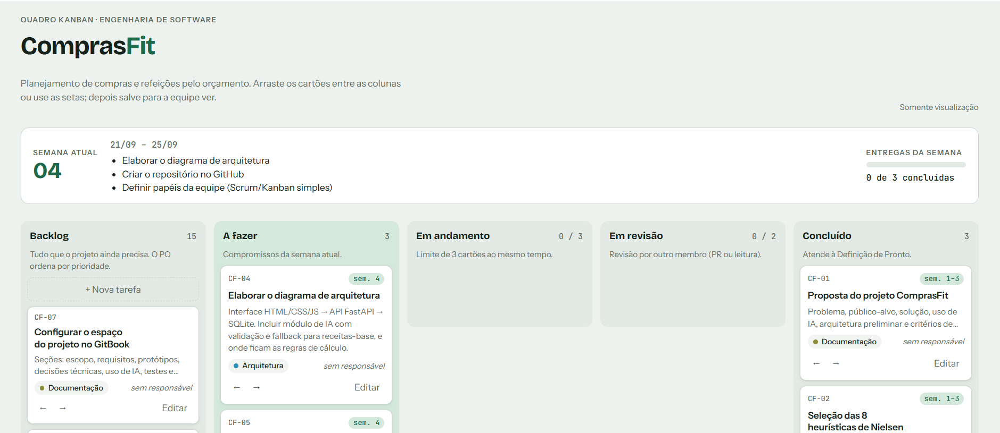

# Planejamento de Entregas A3 - TESTE

&#x20;

## &#x20;Quadro Kanban · Engenharia de Software


[https://claude.ai/artifact/TjC6sNDoErdu8fzMQKBvxZ](https://claude.ai/artifact/TjC6sNDoErdu8fzMQKBvxZ)&#x20;


&#x20;

<figure><figcaption></figcaption></figure>

<figure><figcaption></figcaption></figure>

<figure><figcaption></figcaption></figure>

<figure><figcaption></figcaption></figure>

<figure><figcaption></figcaption></figure>

### REPOSITÓRIOS&#x20;

Back: [https://github.com/A3-Usabilidade-Desenvolvimento-WEB/backend-ComprasFit](https://github.com/A3-Usabilidade-Desenvolvimento-WEB/backend-ComprasFit)

Front: [https://github.com/A3-Usabilidade-Desenvolvimento-WEB/frontend-ComprasFit](https://github.com/A3-Usabilidade-Desenvolvimento-WEB/frontend-ComprasFit)
